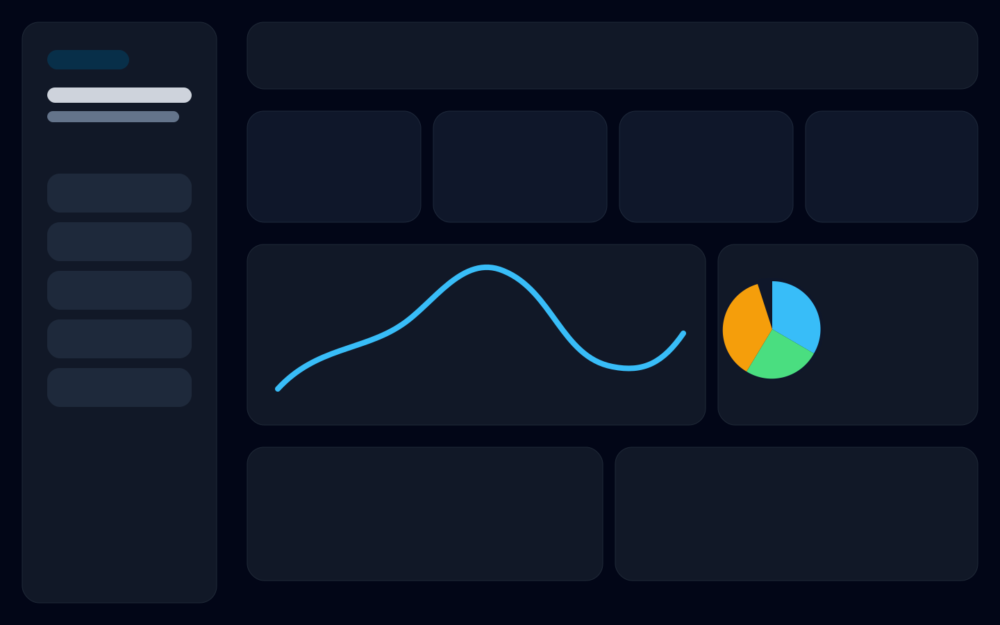
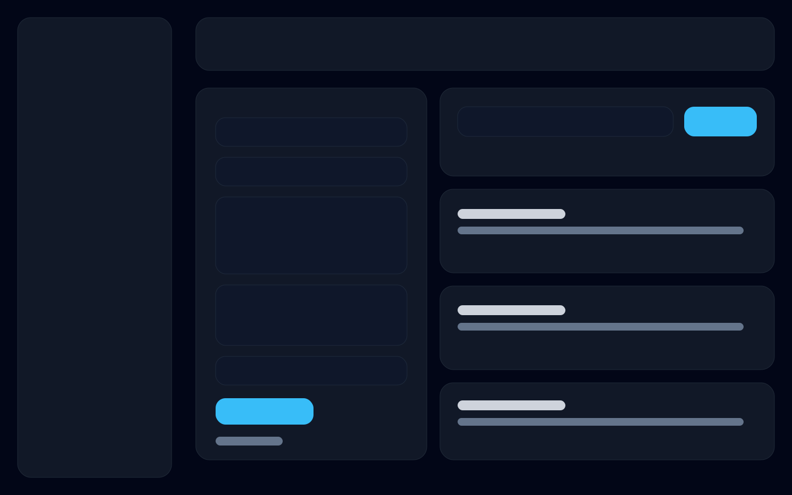

# Ops Deck OSS


Self-hosted operational dashboard for AI agent setups. The public repo ships a dark portfolio-grade UI, seeded safe sample data, JSON-backed telemetry APIs, persistent prompt management, and hybrid lexical or semantic code search.

## Features

- React + Vite + TypeScript dashboard with 8 routes: Dashboard, Cron Calendar, Intel Feed, Security, Infrastructure, Code Search, Prompts, and Backlog.
- Express telemetry API serving JSON-backed cron jobs, architecture, security, backlog, and intel endpoints from [`api/data`](/home/clawdbot/repos/ops-deck-oss/api/data).
- FastAPI code-search service with SQLite indexing and graceful Ollama fallback when `qwen3-embedding:8b` is unavailable.
- Express prompt-library CRUD service with persistent JSON storage and Docker volume support.
- Docker Compose stack for `ui`, `api`, `code-search`, `prompt-library`, and `ollama`.
- Public-safe example data only. No personal data, real credentials, or private infrastructure details.

## Repo Layout

```text
ops-deck-oss/
├── api/
├── code-search/
├── docs/
├── prompt-library/
├── ui/
├── .env.example
├── docker-compose.yml
├── LICENSE
└── README.md
```

## Quick Start

```bash
cp .env.example .env
docker compose up -d --build
docker compose exec ollama ollama pull qwen3-embedding:8b
```

Endpoints:

- UI: `http://localhost:5173`
- API: `http://localhost:8005`
- Prompt Library: `http://localhost:5202`
- Code Search: `http://localhost:5204`
- Ollama: `http://localhost:11434`

## Local Development

```bash
cd api && npm install && npm run dev
cd prompt-library && npm install && npm run dev
cd code-search && python3 -m venv .venv && . .venv/bin/activate && pip install -r requirements.txt && uvicorn app.main:app --host 0.0.0.0 --port 5204
cd ui && npm install && npm run dev
```

The Vite app reads these environment variables:

- `VITE_API_BASE_URL`
- `VITE_PROMPT_LIBRARY_BASE_URL`
- `VITE_CODE_SEARCH_BASE_URL`

## Screenshots

Dashboard preview:



Prompts and search preview:



## Example Data

- Cron jobs with schedule, owner, runtime, and health status.
- Security audit controls and findings.
- Intel feed entries across release, ops, research, and security categories.
- Architecture metadata describing the five-service stack.
- Seed prompts for operations, planning, and threat review workflows.
- Search corpus with architecture notes, runbooks, and prompt patterns.

## Notes

- The code-search service falls back to deterministic local embeddings if Ollama or the model is unavailable.
- Prompt persistence uses a mounted volume in Docker via `prompt-library-data`.
- PM2 deployment notes are available in [docs/pm2-setup.md](/home/clawdbot/repos/ops-deck-oss/docs/pm2-setup.md).

